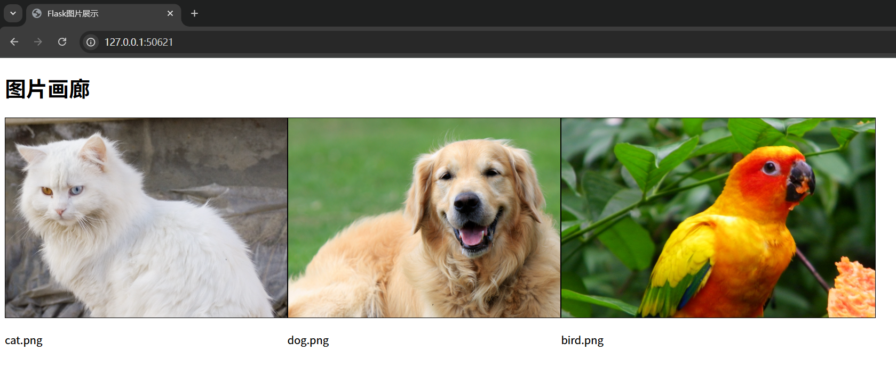

# Flask 图片

## 默认 static 目录

- **后端**：定义了一个路由`/`，传递图片路径列表到模板

- **前端**：使用`url_for`生成图片URL，并循环展示所有图片

- **静态文件结构**：需要在项目根目录下创建`static/images`文件夹，并放入相应图片
- Flask 默认将 `static` 目录作为静态资源根目录，图片通常存放在 `static/images` 子目录中
- Flask 中，`url_for()` 函数可以有效解决模板中图片路径的问题，确保图片资源能够被正确引用，无论项目结构如何变化或部署环境如何调整

确保运行前创建以下文件结构：

```
your_project/
├── app.py
├── static/
│   └── images/
│       ├── cat.jpg
│       ├── dog.jpg
│       └── bird.jpg
└── templates/
    └── index.html
```

```python
from flask import Flask, render_template

app = Flask(__name__)

@app.route('/')
def index():
  # 传递图片路径列表到模板
  image_paths = [
    'images/cat.jpg',
    'images/dog.jpg',
    'images/bird.jpg'
  ]
  return render_template('index.html', image_paths=image_paths)

if __name__ == '__main__':
  app.run(debug=True)    
```

```html
<!DOCTYPE html>
<html>
  <head>
    <title>Flask图片展示</title>
  </head>
  <body>
    <h1>图片画廊</h1>
    <div style="display: flex">
      
        <div >
          
          <p>{{ path.split('/')[-1] }}</p>
        </div>
      
    </div>
  </body>
</html>
```



## 自定义静态文件目录

如果要修改静态文件目录，需要借助 Flask 初始化函数，修改函数的 `static_folder` 和 `static_url_path` 参数

```
your_project/
├── app.py
├── templates/
│   └── index.html
└── assets/
    └── images/
        ├── logo.png
        └── profile.jpg
```

```python
# app.py
from flask import Flask

app = Flask(__name__,
            static_folder='assets',  # 指定静态文件目录为 'assets'
            static_url_path='/assets'  # URL 路径仍为 '/assets'（可选）
           )

@app.route('/')
def index():
    return 'Hello, Flask!'
```

- 在模板中，通过 `url_for('static', filename=...)` 动态生成图片路径：

```html
<!-- index.html -->
<!-- 基础用法 -->


<!-- 动态图片 -->


<!-- 带查询参数的图片（用于缓存控制） -->

```


