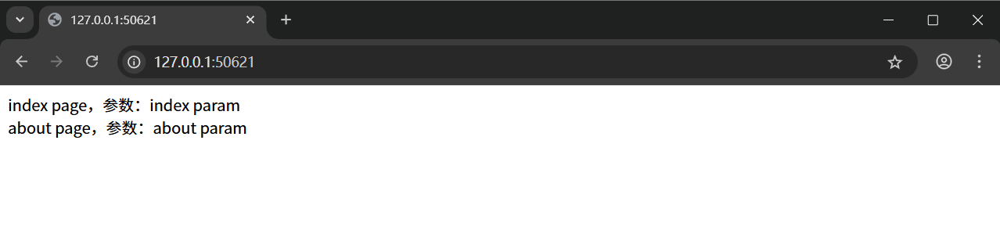

# Flask 模板

## 模板引擎

- Flask默认使用 **Jinja2** 作为模板引擎，可以将Python逻辑与HTML分离
- 支持模板继承、变量渲染、控制结构等特性，非常适合Web开发

- 基本文件结构


```

flask_app/
├── app.py
└── templates/
    └── index.html

```

```python
# app.py
from flask import Flask, url_for, redirect, render_template

app = Flask(__name__)

@app.route('/')
def out():
  temp = render_template("index.html", name="main")
  return temp

if __name__ == '__main__':
  app.run(debug=True, port=50621)
```

```html
<!-- templates/index.html -->

<!DOCTYPE html>
<html lang="en">
  <head>
    <meta charset="UTF-8">
    <title>Index</title>
  </head>
  <body>
    <div>{{ name }}</div>
  </body>
</html>
```


## render_template 函数

在 Flask 中，`render_template` 是一个核心函数，用于将 Jinja2 模板与数据结合，生成最终的 HTML

### 基本用法

```python
from flask import Flask, render_template

app = Flask(__name__)

@app.route('/')
def index():
  # 渲染纯静态 html 页面
  return render_template('index.html')
```

```html
<!-- templates/index.html -->
<body>
  <div>这是一个纯静态 html 文件</div>
</body>
```


### 核心参数

- 参数一：模板文件名，如果是字符串，则只查找一个，如果是数组，则从前往后查找
- 参数二：关键字参数形式传入，可以将参数合并成一个字典，然后用 `**params` 的形式传入

```python
from flask import Flask, url_for, redirect, render_template

app = Flask(__name__)


@app.route('/')
def out():
  index_page_param = "index param"
  about_page_param = "about param"
  params = {
    "index_page_param": index_page_param,
    "about_page_param": about_page_param,
  }
  temp = render_template(["index.html", "404.html"], **params)
  return temp


if __name__ == '__main__':
  app.run(debug=True, port=50621)

```

```html
<body>
  <div>index page，参数：{{index_page_param}}</div>
  <div>about page，参数：{{about_page_param}}</div>
</body>
```




### 自定义模板搜索路径的方式

默认情况下，Flask 在应用根目录下的 `templates` 文件夹中查找模板，因此默认情况下 `templates` 文件夹是一个特殊的目录，除非有自定义操作，否则不能随意命名

```
myapp/
├── app.py
└── templates/
    ├── index.html
    └── user/
        └── profile.html
```

如果想要使用上述的 profile.html 文件，需要把 user 路径带上，相当于就是使用子目录中的模板

```python
render_template("user/profile.html")
```

如果想要自定义模板搜索的目录，核心办法有以下两种：

- 创建应用时指定模板文件夹
- 动态修改 Jinja2 环境的加载器

```python
from flask import Flask, Blueprint, render_template
from jinja2 import ChoiceLoader, FileSystemLoader

# 创建应用并指定主模板文件夹
app = Flask(__name__, template_folder='main_templates')

# 创建蓝图并指定独立模板文件夹
api_bp = Blueprint('api', __name__, template_folder='api_templates')

# 添加额外的模板路径
app.jinja_loader = ChoiceLoader([
  app.jinja_loader,  # 默认加载器（main_templates）
  FileSystemLoader('extra_templates'),  # 额外的模板路径
])

# 视图函数
@app.route('/')
def index():
  return render_template('index.html')  # 从 main_templates 或 extra_templates 查找

@api_bp.route('/docs')
def docs():
  return render_template('docs.html')  # 从 api_templates 查找
```

## 核心语法标签

- `{{ }}` 表达式标签

```python
from flask import Flask, url_for, redirect, render_template

app = Flask(__name__)

@app.route('/')
def out():
    main_content = "page main content"
    content_list = ["item 1", "item 2", "item 3"]
    params = {
        "main_content": main_content,
        "content_list": content_list
    }
    return render_template("index.html", **params)

if __name__ == '__main__':
    app.run(debug=True, port=50621)
```

```html
<!DOCTYPE html>
<html lang="en">
  <head>
    <meta charset="UTF-8">
    <title>Index</title>
  </head>
  <body>
    <!-- 变量 -->
    <div>{{ main_content }}</div>
    <!-- 函数 -->
    <div>{{ main_content.upper() }}</div>
    <!-- 三目运算符 -->
    <div>{{ main_content[0:1:] if main_content else 'N' }}</div>
  </body>
</html>
```


- `` 语句标签

- `{# #}` 注释标签

```html
<body>
  <!-- 不能直接使用推导式，并且必须使用 {# #} 进行注释，html注释依然报错 -->
  <!--{# <div>{{ [content for content in content_list] }}</div> #}-->

  <!-- 语句标签 -->
  
  <div>列表内容：{{ content }}</div>
  
  
  <!-- 注释标签 -->
  {# 这是一个多行注释 #}
  {# 
      可以跨越多行
      注释内容不会出现在渲染结果中
  #}
</body>
```


## 条件语句

```html

    <p>Welcome, Admin!</p>

    <p>Welcome, {{ user.name }}</p>

    <p>Please log in.</p>

```

## 循环语句

```html
<ul>

    <li>{{ item.name }}</li>

</ul>
```

## 模板继承

通过 `extends` 和 `block` 实现模板复用。

- 基模板 `base.html`

```html
<!DOCTYPE html>
<html lang="en">
<head>
    <meta charset="UTF-8">
    <title>Title</title>
</head>
<body>
    <div></div>
</body>
</html>
```

- 子模板 `index.html`

```html



	{{ pagename }}



	{{content}}

```

- main.py

```python
from flask import Flask, request, jsonify, url_for, render_template

app = Flask(__name__)

@app.route('/getpage')
def getpage():
  content = 'ssr content'
  return render_template('index.html' ,content='ssr content', pagename='getpage')

if __name__ == '__main__':
  app.run(port=5173, debug=True)
```

## 内置过滤器

Jinja2 内置过滤器提供了强大的变量处理能力，覆盖字符串、列表、日期等常见场景。

完整内容参考 [Jinja2 官方文档](https://jinja.palletsprojects.com/en/3.1.x/templates/#list-of-builtin-filters)。

过滤器语法：`{{ 变量|过滤器 }}` 

## 字符串过滤器

| 过滤器          | 作用                                  | 示例                          | 结果               |
|-----------------|---------------------------------------|-------------------------------|--------------------|
| `upper`         | 转为大写                              | `{{ "hello" | upper }}`      | `HELLO`            |
| `lower`         | 转为小写                              | `{{ "WORLD" | lower }}`      | `world`            |
| `capitalize`    | 首字母大写                            | `{{ "python" | capitalize }}` | `Python`           |
| `title`         | 每个单词首字母大写                    | `{{ "hello world" | title }}` | `Hello World`      |
| `trim`          | 去除首尾空格                          | `{{ "  abc  " | trim }}`     | `abc`              |
| `striptags`     | 移除 HTML 标签                        | `{{ "<b>text</b>" | striptags }}` | `text`         |
| `truncate`      | 截断字符串并添加省略号                | `{{ "long text here" | truncate(7) }}` | `long...`    |
| `safe`       | 禁用 HTML 转义（信任内容） | `{{ "<script>" | safe }}`              | `<script>`                  |
| `urlencode`  | URL 编码                   | `{{ "name=张三" | urlencode }}`        | `name%3D%E5%BC%A0%E4%B8%89` |

## 列表/字典过滤器

| 过滤器          | 作用                                  | 示例                          | 结果               |
|-----------------|---------------------------------------|-------------------------------|--------------------|
| `length`        | 返回长度                              | `{{ [1,2,3] | length }}`     | `3`                |
| `sum`           | 求和                                  | `{{ [1,2,3] | sum }}`        | `6`                |
| `join`          | 列表转字符串                          | `{{ ["a","b"] | join("-") }}` | `a-b`             |
| `sort`          | 排序                                  | `{{ [3,1,2] | sort }}`       | `[1, 2, 3]`        |
| `reverse`       | 反转列表/字符串                       | `{{ [1,2,3] | reverse }}`    | `[3, 2, 1]`        |
| `first`         | 获取第一个元素                        | `{{ [1,2,3] | first }}`      | `1`                |
| `last`          | 获取最后一个元素                      | `{{ [1,2,3] | last }}`       | `3`                |
| `random`        | 随机选择一个元素                      | `{{ [1,2,3] | random }}`     | `1` 或 `2` 或 `3`  |
| `selectattr`    | 过滤对象列表（按属性）                | `{{ users | selectattr("age", "ge", 18) }}` | 成年用户 |
| `dictsort` | 字典按键/值排序 | `{{ {"b":2,"a":1} | dictsort }}` | `[('a', 1), ('b', 2)]` |
| `batch` | 分批处理列表 | `{{ [1,2,3,4] | batch(2) }}` | `[[1,2], [3,4]]` |
| `groupby` | 按属性分组 | `{{ users | groupby("department") }}` | 部门分组 |
| `reject` | 过滤元素（取反） | `{{ [1,2,3] | reject("odd") }}` | `[2]` |
| `map` | 对每个元素应用函数 | `{{ users | map(attribute="name") }}` | 所有用户名 |

## 日期/时间过滤器

| 过滤器          | 作用                                  | 示例                          | 结果               |
|-----------------|---------------------------------------|-------------------------------|--------------------|
| `datetimeformat` | 格式化日期时间（需自定义）            | `{{ date | datetimeformat("%Y-%m-%d") }}` | `2023-01-01` |
| `timestamp`     | 转为时间戳                            | `{{ date | timestamp }}`     | `1672531200`       |
| `humanize`      | 人性化显示（需 Flask-Moment 等扩展）  | `{{ date | humanize }}`      | `3 days ago`       |

## 过滤器格式化

| 过滤器          | 作用                                  | 示例                          | 结果               |
|-----------------|---------------------------------------|-------------------------------|--------------------|
| `default`       | 设置默认值                            | `{{ name | default("替换值") }}` | `替换值`（若 name 为空） |
| `pprint`        | 美化打印（调试用）                    | `{{ data | pprint }}`        | 格式化后的对象     |
| `abs`           | 绝对值                                | `{{ -5 | abs }}`             | `5`                |
| `int`           | 转为整数                              | `{{ "5" | int }}`            | `5`                |
| `float`         | 转为浮点数                            | `{{ "3.14" | float }}`       | `3.14`             |

## 自定义过滤器

在 Flask 中使用 `@app.template_filter` 装饰器，注册自定义过滤器

### 用于字符串

```python
# app.py
@app.template_filter('reverse')
def reverse_filter(s):
    return s[::-1]
```

```html
<!-- 在模板中使用 -->
<!-- 输出 "olleh" -->
{{ "hello" | reverse }}
```

### 用于时间

```python
from flask import Flask, render_template
from datetime import datetime

app = Flask(__name__)


@app.route('/')
def index():
  params = {
    "date": datetime.now()
  }
  temp = render_template("index.html", **params)
  return temp

@app.template_filter('timeFormat')
def time_format(date):
  return date.strftime("%B %d, %Y")

if __name__ == '__main__':
  app.run(debug=True, port=50621)
```

```html
<body>
{{ date | timeFormat }}
</body>
```


## 过滤器应用

### 链式调用

```html
<body>
{{ date | timeFormat | upper }}
</body>
```


## 变量管理

在 Flask 的 Jinja2 模板引擎中，**变量管理**是控制模板内数据流动和作用域的重要机制。其中，`set` 和 `with` 是两种核心语法，用于定义变量和限定变量作用域。

| 特性         | `set`                   | `with`                           |
| ------------ | ----------------------- | -------------------------------- |
| **作用域**   | 全局（直到模板/块结束） | 仅在 `with` 块内有效             |
| **变量污染** | 可能影响后续代码        | 完全隔离，不影响外部             |
| **主要用途** | 存储中间结果、状态变量  | 临时计算、传递参数               |
| **语法**     | ``       | `` 或单独 `with` |

### set 语句：定义和修改变量

在模板中直接定义变量，可用于存储中间结果或计算值，由 `set` 定义的变量在定义位置之后的整个模板或块内有效：

```html

    

    


<p>用户角色：{{ role }}</p>
```

- 定义字符串

```html

<h1>{{ greeting }}</h1>  <!-- 输出: Hello, World! -->
```

- 使用过滤器辅助

```html

<p>共有 {{ total }} 项</p>


<p>{{ message }}</p>  <!-- 输出: HELLO FLASK! -->
```

- 定义列表、字典等

```html


<p>{{ user.name }} 今年 {{ user.age }} 岁</p>
```

### with 语句：创建独立命名空间

`with` 用于创建一个临时作用域，变量仅在 `with` 块内有效

```html

    
    <p>{{ message }}</p>  <!-- 有效 -->


<p>{{ message }}</p>  <!-- 报错：变量未定义 -->
```

- 处理临时数据，避免污染全局作用域

```html

    
        <ul class="errors">
            
                <li>{{ error }}</li>
            
        </ul>
    

```

- 可直接在 `with` 语句中定义变量：

```html

    <p>原价: {{ price }}</p>
    <p>折扣价: {{ price * discount }}</p>

```

- 在循环中使用 `with` 避免变量覆盖

```html

    
        
        <p>{{ processed_item.name }}</p>
    

```

- 嵌套 `with` 块

```html

    
    <p>外层: {{ x }}</p>  <!-- 10 -->
    
    
        <p>内层: {{ x }}</p>  <!-- 20 -->
    
    
    <p>恢复: {{ x }}</p>  <!-- 10 -->

```

## 宏（Macros）

类似函数，可复用代码片段

```html
<!-- 定义宏 -->

    <div class="form-group">
        {{ field.label }}
        {{ field() }}
    </div>


<!-- 使用宏 -->
{{ render_field(form.username) }}
{{ render_field(form.password) }}
```

## 模板性能优化

### 缓存静态模板

```python
# 在 Flask 中配置模板缓存
app.config['TEMPLATES_AUTO_RELOAD'] = False  # 生产环境禁用自动重载
```

### Flask-Caching

```html
  <!-- 缓存1小时 -->
  <div class="sidebar">
    <!-- 耗时的侧边栏内容 -->
  </div>

```

### flask_compress

```python
from flask_compress import Compress

app = Flask(__name__)
Compress(app)  # 启用 Gzip 压缩
```


