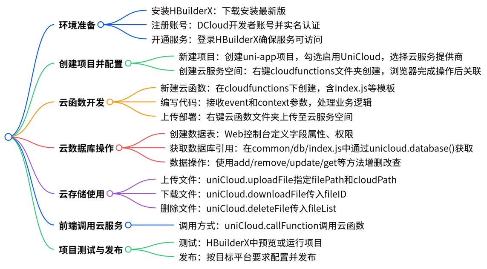

# unicloud 云开发

## 概述

UniCloud是DCloud推出的基于serverless模式和js编程的云开发平台。

- [uniCloud概述 | uniCloud](https://doc.dcloud.net.cn/uniCloud/) 

- 开发者中心 [应用列表](https://dev.dcloud.net.cn/pages/app/list) 

## 开发流程


## 云函数开发


2. **保证 uni-app 应用标识 appID 填写**（保证用户为登录状态）

   

3. **进行云服务空间创建**

   

   > 如果未进行实名认证，会跳转至实名认证页面进行实名认证，等待实名认证审核之后可以开通服务空间。若腾讯云实名认证提示身份证下已创建过多账户，则需要在腾讯云官网注销不用的账户

4. 进行云函数创建

   

   ```js
   'use strict';
   // 一个通过nodeJS运行的函数在服务器端使用
   exports.main = async (event, context) => {
   	//event为客户端上传的参数
   	//context 包含了调用信息及运行状态,获取每次调用的上下文
   	console.log('event : ', event)
   	
   	//返回数据给客户端
   	return {
   		"code":0,
   		"msg":"云函数调用成功"
   	}
   };
   ```

   

5. **云 WEB 控制台查看**

   

6. **云数据库操作**

   > 在云数据库中进行数据操作，全部使用双引号进行值的定义

7. 云存储

   > 在云存储中进行文件的上传
   >
   > api 使用：
   >
   > ```js
   > uniCloud.uploadFile({})
   > ```

8. 跨域处理

   参考文档 https://uniapp.dcloud.io/uniCloud/quickstart?id = useinh5
